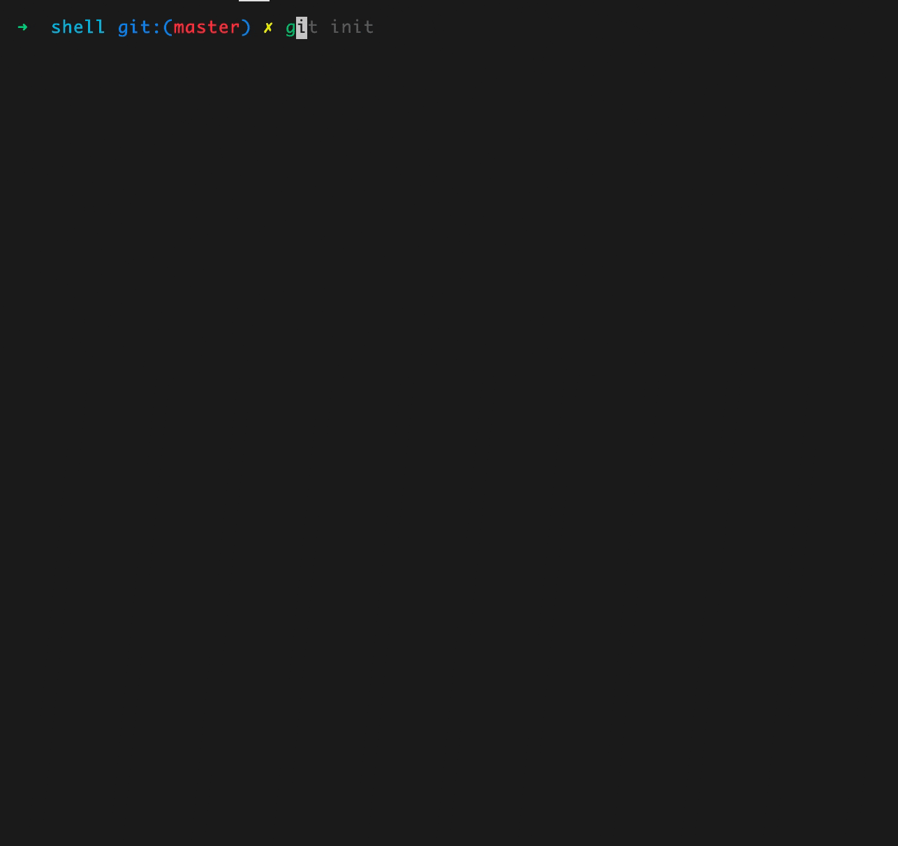

# @fantasticit/code-lint



## Usage

```bash
yarn add @fantasticit/code-lint -D -W
```

then just run:

```bash
yarn fantasticit-code-lint init
```

you can see these files added in your project:

```bash
.editorconfig

.prettierignore
.prettierrc.js

stylelint.config.js

.eslintignore
.eslintrc.js

.cz-config.js
commitlint.config.js

lint-staged.config.js
.huskyrc.js
```

Have fun coding.
